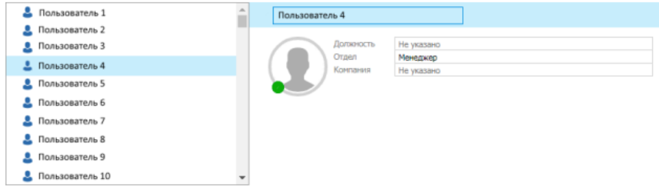

Необходимо разработать небольшое веб-приложение, которые обладает очень ограниченным функционалом для просмотра и редактирования данных пользователя(id, имя, фамилия, возраст, адрес электронной почты). При нажатии на карточку пользователя – справа открываются поля для редактирования, под которым находится кнопка сохранить. При листании списка пользователей UI должен оставаться отзывчивым и работать без подвисаний;

В качестве источника данных – json-файл/замоканый backend/любое иное аналогичное решение с рандомными данными вида Array<{name: string, department: string, company: string, jobTitle: string}>.

Объем данных: 1 миллион пользователей.
Стек технологий: HTML, CSS or preprocessors, React, Redux;

Главное условие: стабильная работа веб-приложения при большом объеме данных

---

Шаг 0. Создайте .env в папках client и fake-api.

Шаг 1. Запустите сервер

```bash
cd ../fake-api
npm i & npm run start
```

Шаг 3:

```bash
cd ../client
npm i & npm run dev
```
